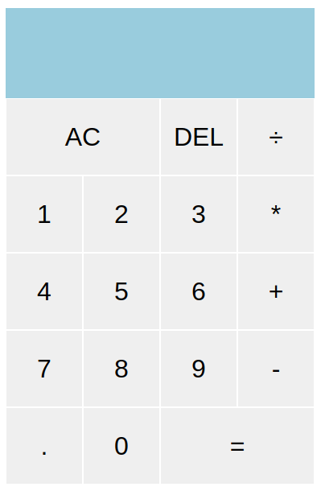

# Schickard App

A spartan calculator.

The name 'Schickard' derives from 'Wilhelm Schickard', who built the first known mechanical calculator.

## Table Of Contents

- [Demo](#demo)
- [Introduction](#introduction)
- [Features](#features)
- [Stack](#stack)

## Demo

https://schickard.vercel.app/

## Introduction

The objective is to learn in-depth about React component re-rendering and state management.

## Features

- `AC` button, `DEL` button, elementary arithmetic operations' buttons, & numbers' buttons:

  

## Stack

- React 18
- Vite 5
